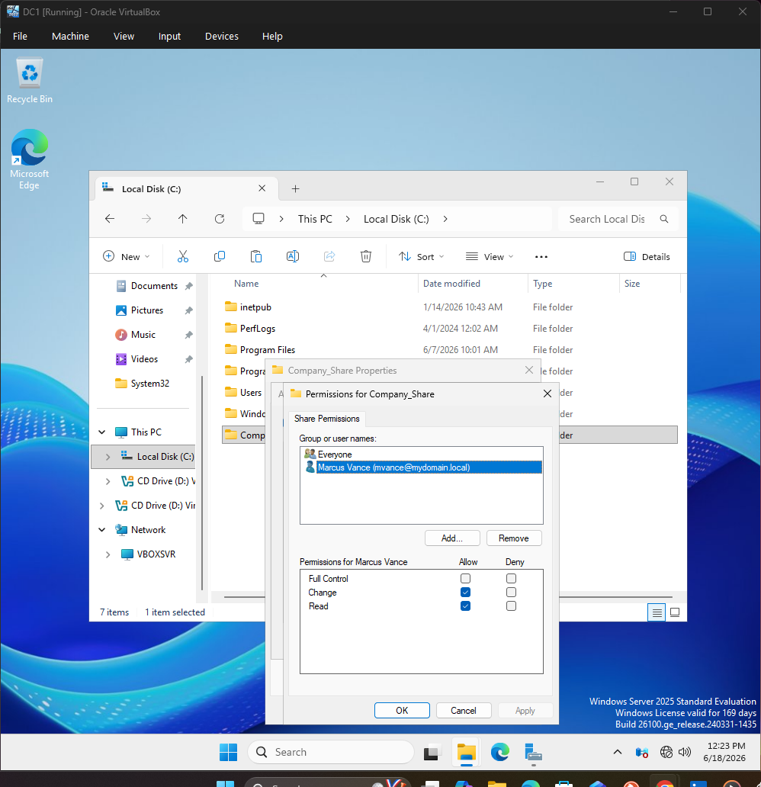
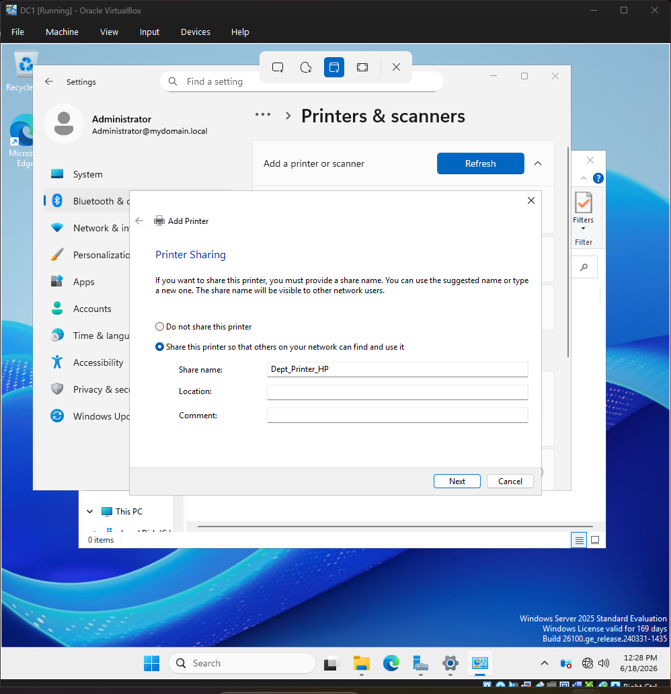
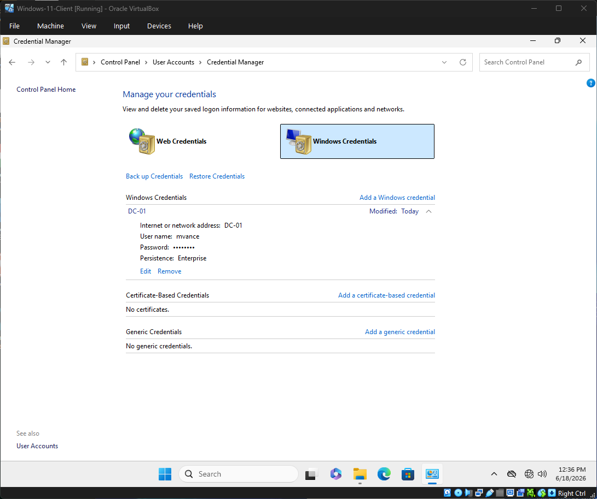
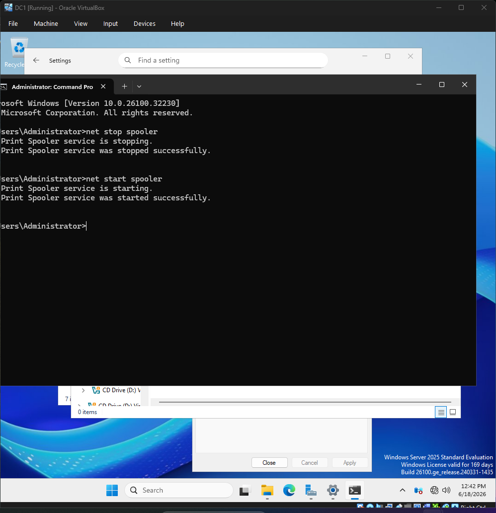
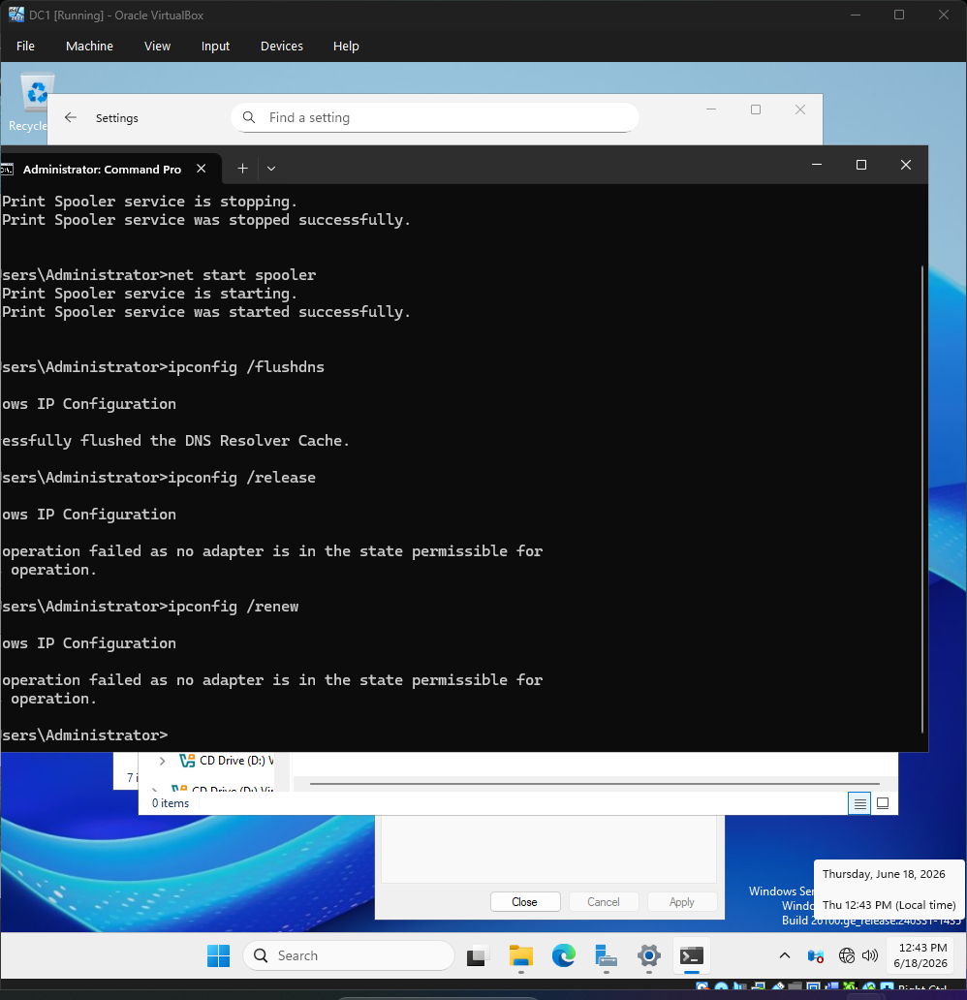

# Active Directory Network Lab & Help Desk Simulation

## 📌 Project Overview
This lab demonstrates enterprise-level IT support, system administration, and network troubleshooting techniques within a Windows Server and Windows 11 Client virtual environment.

## 🛠️ Technologies Used
* **Hypervisor:** Oracle VirtualBox
* **Server OS:** Windows Server 2025 Standard Evaluation (`DC-01`)
* **Client OS:** Windows 11 Enterprise Evaluation (`W11-CLIENT-01`)
* **Core Services:** Active Directory Domain Services (AD DS), DNS, Print Spooler, Windows Credential Manager

---

## 🚀 Tasks Completed

### Task 1: Enterprise Printer Sharing & Active Directory Publishing
* Configured a shared local network printer (`Dept_Printer_HP`) using generic drivers on the domain controller.
* Enabled Active Directory directory publishing to allow domain users to easily locate network printing resources.

*Figure 1: Configuring file sharing permissions for the 'Company_Share' folder on the Domain Controller.*

---

### Task 2: Troubleshooting Network Share Pathing
* Successfully mapped a network directory (`\\DC-01\Company_Share`) to user profile `mvance`.
* Diagnosed and resolved standard short-name resolution conflicts by implementing fully qualified domain name (FQDN) mapping.

*Figure 2: Setting up network printer sharing for 'Dept_Printer_HP' within the server settings panel.*

---

### Task 3: Resolving Stale User Credentials
* Managed cached network credentials via Windows Credential Manager to address authentication issues resulting from user password updates.

*Figure 3: Inspecting and clearing cached domain credentials for user `mvance` inside Windows Credential Manager.*

---

### Task 4: Clearing Frozen Print Queues
* Administered the local print subsystem using the command line interface to stop and start the Print Spooler service (`net stop spooler` / `net start spooler`).
* Inspected and cleared the system print directory (`C:\Windows\System32\spool\PRINTERS`) to clear stuck jobs.

*Figure 4: Utilizing administrative CLI commands to systematically cycle the local Print Spooler subsystem service.*

---

### Task 5: Network Stack Flush
* Maintained local client network health by clearing local DNS caches (`ipconfig /flushdns`) and resetting active interface adapter bounds.

*Figure 5: Successfully flushing the local client DNS resolver cache via the administrative command line interface.*

---

## 🎓 Summary of Real-World Technical Outcomes

### 🧠 What I Learned
* **Active Directory Resource Publishing:** Learned how enterprise resources like printers are registered and discovered globally within an AD DS environment rather than mapped manually per seat.
* **Windows Subsystem Architecture:** Gained deep insights into how Windows handles printer jobs dynamically via `.SPL` and `.SHD` format tracking files in system folders.
* **Credential Token Caching:** Developed an understanding of how local client operating systems temporarily retain Windows Generic and Internet credentials to support single sign-on (SSO) experiences.

### 🛠️ What I Fixed
* **DNS/Short-Name Share Resolution:** Resolved a "Windows cannot access" error during drive mapping by leveraging FQDN paths and validating structural share configuration properties on the server side.
* **Stale Domain Tokens:** Fixed broken, permission-denied drive mapping events by clearing expired password caches within the client's local security database.
* **Frozen Print Services:** Repaired a locked local hardware queue by utilizing elevated system commands to cycle service dependencies and wipe out corrupt layout documents.

### 💼 Corporate & Day-to-Day Application
* **Tier 1 / Tier 2 Help Desk Alignment:** The specific tasks completed in this simulation represent the highest volume tickets handled by enterprise service desks daily (e.g., locked print arrays, missing target folders, and broken connections post-password changes).
* **Minimizing Enterprise Downtime:** Standardizing workflow scripts to flush DNS configurations or clear local system folders allows technicians to resolve client disruptions in minutes without needing to re-image operating systems or execute unnecessary hardware reboots.
* **Least Privilege Best Practices:** Managing shares, print queues, and directory structures directly mimics the strict data-governance standards required in highly compliant corporate settings.
